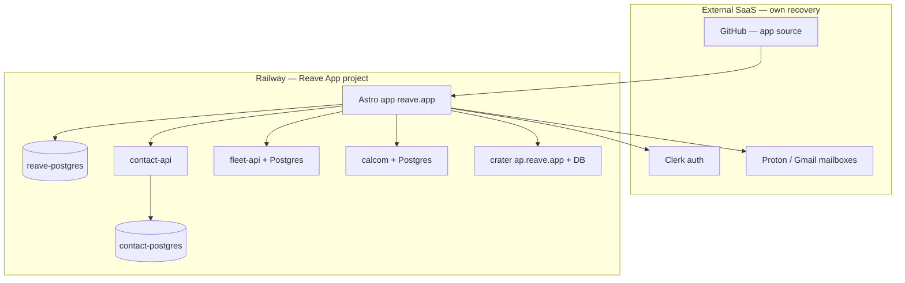

# Pre-production contingency audit

Last reviewed: 2026-08-04

Use this before a sale, major launch, or handing the stack to a new operator. It covers **data loss**, **identity drift**, and **deploy failure** — the contingencies that matter for Reave today.

## TL;DR — do these first

1. **Turn on Railway backups** for every Postgres service in **Reave App** (production):
   - `reave-postgres` (app data)
   - `contact-postgres` (clients + vault credentials — highest priority)
   - Postgres behind `fleet-api`, `calcom-booking-api`, and `crater` (separate repos/services)
2. **Enable PITR** (point-in-time recovery) on production Postgres volumes where Railway offers it — covers bad migrations and accidental `DROP` between snapshots.
3. **Run one restore drill** to a throwaway Railway environment (not Reave Demo) and confirm you can read data back.
4. **Schedule offsite `pg_dump`** (daily) to storage outside the Postgres volume — native Railway snapshots do not survive project/volume deletion. See [Railway Postgres backups](https://docs.railway.com/guides/postgres-backups-restores) and `scripts/backup-postgres.sh` in this repo.
5. **Confirm `DATABASE_URL` is set** on the production Astro service — without it, chats/jobs/email inbox fall back to ephemeral container files.

---

## Architecture at a glance



**Code** redeploys from GitHub. **Runtime data** lives in Postgres (and Clerk/Proton for auth/mail originals). Losing Postgres without backups is not recoverable from git.

---

## Database inventory

| Database | Railway service | What you lose if it’s gone | Backup priority |
|----------|-----------------|----------------------------|-----------------|
| **contact-postgres** | `contact-postgres` | All clients, PII, CardDAV, portal credentials, vault secrets | **Critical** |
| **reave-postgres** | `reave-postgres` | Jobs, chats, email triage log, project files (base64), Kap recordings, company config, newsletter state | **Critical** |
| **Crater DB** | `crater` @ `ap.reave.app` | Invoices, payments, billing history | **Critical** |
| **Cal.com Postgres** | `calcom-booking-api` / web app | Bookings and schedule | **High** |
| **fleet-api Postgres** | `fleet-api` | Vehicle locations and history | **Medium** |
| **materials-api / inventory-api** | API-only in this repo | Pricing/inventory cache (re-fetchable) | **Low** |

Schema for the app DB is created at runtime (`ensureSchema()` in `src/lib/*Store.ts`). SQL files under `supabase/migrations/` are a **manual reference**, not auto-run on deploy.

---

## Current safeguards (already in place)

| Area | Status | Where |
|------|--------|-------|
| App source control | GitHub → auto-deploy on `main` | `GITHUB_AND_RAILWAY.md` |
| Deploy failure alerts | Railway webhook → email + optional agent | `plugins/dev-infra/knowledge/railway-deploy-webhook.md` |
| Health probes | Admin System tab + `/api/health/live` | `src/pages/api/health.ts`, `src/pages/api/health/live.ts` |
| Clerk chat recovery | Owner API to reassign threads after Clerk id change | `POST /api/admin/chats` — `src/pages/api/admin/chats.ts` |
| Kinsta WP backups | Agent tools for **client WordPress sites only** | `plugins/dev-infra/knowledge/kinsta-wordpress.md` |
| Demo isolation | Reave Demo is a **separate** Railway project with empty DBs | `GITHUB_AND_RAILWAY.md`, `plugins/demo/knowledge/demo-setup.md` |
| Email originals | Full bodies stay in Proton/Gmail; Reave stores triage metadata | `src/knowledge/email-rules.md` |

---

## Gaps (prioritized)

### Critical

- **No in-repo Postgres backup automation** — nothing runs `pg_dump` on a schedule today.
- **Railway native backups unverified** — must be confirmed in the Railway dashboard per service.
- **No disaster-recovery runbook was checked in** until this document; restore order is undocumented.
- **Binary blobs in Postgres** (`project_files`, `kap_recordings`) inflate backup size and restore time.

### High

- **Schema drift** between runtime `ensureSchema()` and `supabase/migrations/` (e.g. `knowledge` vs `knowledge_entries`).
- **Chat recovery API has no admin UI** — owner must call HTTP API manually after Clerk instance changes.
- **Poll jobs** (newsletter, uptime, lead scanner) rely on in-process timers; external Railway cron is safer.

### Medium

- **Clerk outage** — no local user directory; document Clerk export and owner env vars (`AGENT_ALERT_USER_ID`, `ADMIN_USERNAME`).
- **Cross-region DR** — Railway does not replicate backups across regions; offsite dumps are the only true DR copy.

---

## Backup strategy (recommended layers)

Use **all three** layers for production Postgres:

| Layer | Purpose | Where to configure |
|-------|---------|-------------------|
| **1. Volume backups** | Coarse rollback (yesterday’s whole DB) | Railway → service → **Backups** tab |
| **2. PITR** | Restore to a specific minute (bad migration, accidental delete) | Railway → enable PITR on Postgres volume |
| **3. Offsite logical dump** | Survives project/volume deletion; portable to another host | Daily cron + `pg_dump` → S3/R2/Railway bucket |

### Manual dump (operator laptop)

From repo root, with Railway CLI linked to **Reave App** production:

```sh
npm run sync:env          # refreshes DATABASE_URL (public proxy)
npm run backup:postgres   # writes to backups/ (gitignored)
```

Or with an explicit URL:

```sh
DATABASE_URL='postgresql://…' npm run backup:postgres
```

For **contact-postgres**, pull `DATABASE_PUBLIC_URL` from the `contact-postgres` service in Railway and pass it the same way (contact DB is not wired into `sync:env` today).

### Automated offsite dumps

Deploy Railway’s [postgres-s3-backups](https://github.com/railwayapp-templates/postgres-s3-backups) template (or equivalent cron) **once per production Postgres service**, writing to a bucket **outside** the Postgres volume. Tag a manual dump before risky migrations.

---

## Restore drill checklist

Do this at least once before go-live, then quarterly:

- [ ] Pick a non-production target (new Railway environment — **not** Reave Demo empty DB if you need realistic parity).
- [ ] Restore `contact-postgres` first (app depends on contact-api for client resolution).
- [ ] Restore `reave-postgres`; hit `/api/health` as an authenticated admin and confirm Postgres probe is `up`.
- [ ] Spot-check: one chat thread, one job, one client record, one invoice in Crater.
- [ ] Document how long restore took (your RTO) and how much data you’d lose if the incident happened now (your RPO = time since last successful dump).

---

## Pre-sale / pre-production sign-off

### Must pass

- [ ] Automated backups **enabled and verified** on `reave-postgres` and `contact-postgres`
- [ ] Crater, Cal.com, and fleet Postgres backup coverage confirmed (separate services)
- [ ] At least one **successful restore drill** documented with date and operator
- [ ] Offsite daily `pg_dump` scheduled for critical databases
- [ ] Production Astro service has `DATABASE_URL` set (check Admin → System or Railway variables)
- [ ] `AGENT_ALERT_USER_ID` / `ADMIN_USERNAME` match the real owner account
- [ ] Railway webhook + `RAILWAY_WEBHOOK_SECRET` configured for deploy failure alerts
- [ ] Reave Demo and Reave App use **different** `DATABASE_URL` values (never shared)

### Should pass

- [ ] PITR enabled on production Postgres volumes
- [ ] Railway cron hits `/api/newsletter/poll`, `/api/uptime/poll`, `/api/lead-scanner/poll` with poll secrets
- [ ] Chat recovery procedure documented for Clerk key/instance rotation (`GET`/`POST /api/admin/chats`)
- [ ] Pre-migration manual backup tagged in offsite storage
- [ ] Clerk organization export / break-glass owner access documented

### Nice to have

- [ ] Move large blobs (`project_files`, `kap_recordings`) to object storage; keep metadata in Postgres
- [ ] Single migration runner aligned with `supabase/migrations/`
- [ ] Admin UI for chat recovery

---

## Incident playbooks (short)

### “Postgres is empty / wrong after deploy”

1. Stop writes (pause app or put up maintenance) if data is still corrupting.
2. Check Railway Postgres metrics and recent deploys.
3. If bad migration: **PITR** to timestamp before deploy.
4. If volume loss: restore from **offsite pg_dump** (only layer that survives deletion).
5. Restore contact-postgres before app postgres if both affected.

### “Clerk login works but admin chats are missing”

Likely Clerk `user_id` changed — not data loss. Owner: `GET /api/admin/chats`, then `POST` with `{ "action": "reassign", "from": "<old>", "to": "<new>" }`. Postgres backend required.

### “Deploy failed on Railway”

Webhook should email via `RAILWAY_ALERT` rule. Check `deploy_incidents` table and Railway logs. Optional: `RAILWAY_INCIDENT_HANDLER=1` for agent triage.

### “Need Kinsta client site back”

Use agent tools `list_kinsta_backups` / restore via MyKinsta — **does not apply** to Reave on Railway.

---

## Related docs

- `GITHUB_AND_RAILWAY.md` — deploy workflow, Reave App vs Reave Demo
- `src/knowledge/contact-api-reference.md` — contact-postgres as master client DB
- `plugins/billing/knowledge/crater-billing.md` — billing authority
- `plugins/demo/knowledge/demo-setup.md` — demo DB isolation
- [Railway Postgres backups & restores](https://docs.railway.com/guides/postgres-backups-restores)
